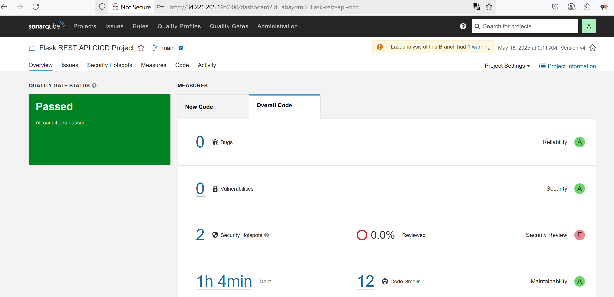

# Full CI/CD Pipeline for Flask Application on AWS EKS
## (Jenkins, Terraform, Docker, Kubernetes, Prometheus, Grafana, Trivy, SonarQube)

This project demonstrates a comprehensive, end-to-end CI/CD pipeline that automates the build, test, security scan, static code analysis, deployment, and validation of a Python Flask web application to a Kubernetes cluster (AWS EKS).

**Core Technologies & Features:**
* **Infrastructure as Code (IaC):** AWS EKS cluster provisioned using Terraform.
* **CI/CD Orchestration:** Jenkins server on AWS EC2.
* **Containerization:** Application containerized with Docker, images stored on Docker Hub.
* **Orchestration:** Deployment to AWS EKS (Elastic Kubernetes Service).
* **Application:** Python Flask REST API with an HTML homepage and Prometheus metrics exporter.
* **Automated Testing:** Unit tests for the Flask application integrated into the pipeline.
* **Static Code Analysis:** SonarQube integration for code quality and vulnerability assessment.
* **Security Scanning:** Docker image vulnerability scanning using Trivy.
* **Monitoring & Visualization:** Metrics collection with Prometheus and dashboarding with Grafana.
* **Post-Deployment Validation:** Automated smoke tests.
* **Continuous Integration:** GitHub webhook triggers the Jenkins pipeline on code pushes.

## Project Overview

The objective is to showcase a robust DevOps workflow encompassing:
1.  **Infrastructure Provisioning:** Automated setup of AWS EKS.
2.  **CI/CD Server Setup:** Configuration of a Jenkins server with all necessary build, test, and deployment tools.
3.  **Application Development:** A Flask application with API endpoints, a user-friendly homepage, and Prometheus metrics.
4.  **Automated Pipeline (`Jenkinsfile`):**
    * Checkout code from GitHub.
    * Run unit tests.
    * Perform static code analysis with SonarQube.
    * Build Docker image.
    * Scan Docker image for vulnerabilities with Trivy.
    * Push image to Docker Hub.
    * Configure `kubectl` for EKS.
    * Update Kubernetes manifests.
    * Deploy to EKS.
    * Run smoke tests.
5.  **Monitoring Stack:** Deployment of Prometheus and Grafana to EKS.
6.  **Continuous Integration:** Automated pipeline triggers via GitHub webhooks.

## Prerequisites

* AWS Account with necessary permissions.
* AWS CLI configured locally (for initial Terraform setup if not using an IAM role).
* Terraform CLI installed locally.
* Git installed locally.
* GitHub account and a repository for this project.
* Docker Hub account.
* Text editor or IDE (e.g., VS Code).

## Project Structure


 

---

## Detailed Project Stages

### Stage 1: Infrastructure as Code (IaC) with Terraform

**Goal:** Provision an AWS EKS cluster.
**Steps:**
1.  Navigate to `terraform/`.
2.  Review `main.tf` (defines AWS provider, VPC/subnet data sources, IAM roles for EKS, EKS cluster, and node group). Ensure variables (e.g., `aws_region`, `cluster_name`) are set.
3.  Initialize Terraform: `terraform init`
4.  Plan deployment: `terraform plan`
5.  Apply configuration: `terraform apply` (confirm with `yes`). This takes 15-25 minutes.
6.  Configure `kubectl` locally to interact with your new cluster:
    ```bash
    aws eks update-kubeconfig --region <your-region> --name <your-cluster-name>
    # Example: aws eks update-kubeconfig --region us-east-1 --name my-dev-eks-cluster
    ```

---

### Stage 2: Jenkins Server Setup on AWS EC2

**Goal:** Set up an EC2 instance as a Jenkins CI/CD server with all tools.
**Tools to Install on Jenkins Server:**
* Java (OpenJDK 17)
* Jenkins
* Docker Engine
* AWS CLI v2
* `kubectl`
* Python 3, `pip3`, `python3-venv` (e.g., `python3.12-venv`)
* Trivy
* SonarScanner CLI
* Git

**Steps:**
1.  **Launch EC2 Instance:** Ubuntu Server (e.g., 22.04/24.04 LTS), `t3.medium` or larger recommended if running SonarQube on the same instance.
    * **Security Group:** Allow inbound SSH (port 22 from your IP), HTTP (port 8080 for Jenkins UI from your IP/GitHub IPs), and HTTP (port 9000 for SonarQube UI from your IP).
    * **IAM Role:** Attach an IAM Role to the EC2 instance granting permissions for `eks:DescribeCluster` (for `aws eks update-kubeconfig`) and any other AWS interactions needed by Jenkins.
2.  **Install Tools:** Connect via SSH and run the comprehensive `install_jenkins_server_tools.sh` script (as provided in earlier discussions, which includes all the tools listed above). This script should also add the `jenkins` user to the `docker` group and restart Jenkins.
3.  **Initial Jenkins Setup:**
    * Access Jenkins: `http://<your_ec2_public_ip>:8080`.
    * Unlock Jenkins: `sudo cat /var/lib/jenkins/secrets/initialAdminPassword`.
    * Install suggested plugins and create an admin user.
4.  **Configure Jenkins Credentials:**
    * **Docker Hub:** "Manage Jenkins" -> "Credentials" -> "System" -> "Global credentials" -> "Add Credentials". Kind: "Username with password", ID: `dockerhub-credentials`.
    * **SonarQube Token (see Stage 7 for token generation):** Kind: "Secret text", ID: `sonarqube-auth-token`.
5.  **Configure SonarQube in Jenkins:**
    * "Manage Jenkins" -> "Configure System":
        * **SonarQube servers:** Add SonarQube server. Name: `MyLocalSonarQube` (must match `Jenkinsfile`), Server URL: `http://localhost:9000` (if SonarQube Docker is on the same Jenkins EC2), Server authentication token: Select the `sonarqube-auth-token` credential.
    * "Manage Jenkins" -> "Global Tool Configuration":
        * **SonarQube Scanner:** Add SonarQube Scanner. Name: `SonarScannerCLI` (must match `Jenkinsfile`), uncheck "Install automatically", Installation directory: Path to your SonarScanner CLI installation (e.g., `/opt/sonar-scanner-7.1.0.4889-linux-x64`).

---

### Stage 3: Application Development & Containerization

**Goal:** Develop the Flask app with API, homepage, metrics, tests, and Dockerfile.
**Steps:**
1.  **Flask Application (`application/app.py`):**
    * Includes HTML homepage, REST API endpoints (`/api/v1/health`, `/api/v1/devices/...`), and Prometheus metrics exporter (`/metrics` endpoint).
2.  **Python Dependencies (`application/requirements.txt`):**
    * Lists `Flask`, `Werkzeug==2.3.8` (pinned version), `prometheus_flask_exporter`.
3.  **Unit Tests (`application/test_app.py`):**
    * `unittest` based tests for API endpoints.
4.  **Dockerfile (`application/Dockerfile`):**
    * Containerizes the Flask application.

---

### Stage 4: SonarQube Server Setup & Project Configuration

**Goal:** Run SonarQube server and prepare project for analysis.
**Steps:**
1.  **Run SonarQube Server (Docker on Jenkins EC2):**
    ```bash
    # Ensure Docker is running on the Jenkins EC2 instance
    docker volume create sonarqube_data
    docker volume create sonarqube_logs
    docker volume create sonarqube_extensions

    docker run -d --name sonarqube \
        -p 9000:9000 \
        -e SONAR_ES_BOOTSTRAP_CHECKS_DISABLE=true \
        -v sonarqube_data:/opt/sonarqube/data \
        -v sonarqube_logs:/opt/sonarqube/logs \
        -v sonarqube_extensions:/opt/sonarqube/extensions \
        sonarqube:9.9.5-community # Or your chosen version
    ```
    * Access UI: `http://<JENKINS_EC2_IP>:9000` (login: admin/admin, then change password).
2.  **Generate SonarQube Authentication Token:**
    * In SonarQube UI: User Avatar -> My Account -> Security -> Generate Token (e.g., `jenkins_scanner_token`). Save this token to add to Jenkins credentials as `sonarqube-auth-token`.
3.  **Create `sonar-project.properties`:**
    * In the root of your Git repository, create `sonar-project.properties` defining `sonar.projectKey`, `sonar.projectName`, `sonar.sources=application`, `sonar.language=py`, `sonar.exclusions=**/venv/**, **/.venv/**`.

---

### Stage 5: Kubernetes Manifests (Application & Monitoring)

**Goal:** Define Kubernetes resources for the application and monitoring stack.
**Steps:**
1.  **Application Manifests (`kubernetes/`):**
    * `deployment.yaml`: For the Flask app. Ensure label `app: my-simple-app`.
    * `service.yaml`: Type `LoadBalancer` for the Flask app.
2.  **Monitoring Stack Manifests (`monitoring/`):**
    * **Prometheus (`monitoring/prometheus/prometheus-setup.yaml`):** Namespace, RBAC, ConfigMap for `prometheus.yml` (scrape job for `app: my-simple-app` on port 5000, path `/metrics`), Prometheus Deployment, and Service (type `NodePort`).
    * **Grafana (`monitoring/grafana/grafana-setup.yaml`):** Grafana Deployment and Service (type `NodePort`). Uses `emptyDir` for storage.
3.  **Apply Monitoring Manifests (Manual step after EKS is up):**
    ```bash
    kubectl apply -f monitoring/prometheus/prometheus-setup.yaml
    kubectl apply -f monitoring/grafana/grafana-setup.yaml
    ```
    Verify pods in `monitoring` namespace are running: `kubectl get all -n monitoring`.

---

### Stage 6: Jenkins CI/CD Pipeline (`Jenkinsfile`)

**Goal:** Automate the entire build-to-deploy lifecycle.
**Key Pipeline Stages (refer to `jenkinsfile_with_sonarqube_final`):**
1.  **(Implicit SCM Checkout)**
2.  **Run Unit Tests:** Installs `requirements.txt` in a venv and runs `python3 -m unittest discover`.
3.  **SonarQube Analysis:** Uses `withSonarQubeEnv` and `tool 'SonarScannerCLI'` to run `sonar-scanner`.
4.  **Quality Gate Check:** (Informational stage; full implementation requires SonarQube webhooks and Jenkins Quality Gate plugin).
5.  **Build Docker Image:** Builds and tags the application image.
6.  **Scan Docker Image with Trivy:** Scans image for `HIGH,CRITICAL` vulnerabilities (`trivy image --exit-code 0 ...`).
7.  **Login to Docker Hub.**
8.  **Push Docker Image to Docker Hub.**
9.  **Configure Kubectl:** Runs `aws eks update-kubeconfig`.
10. **Update Kubernetes Manifests:** Uses `sed` to set the image tag in `deployment.yaml`.
11. **Deploy to EKS:** Applies application manifests and waits for rollout.
12. **Smoke Test Application:** Executes `smoke_test.sh` against the LoadBalancer URL after a delay.

**Jenkins Job Configuration:** Create "Pipeline" job, "Pipeline script from SCM", point to Git repo, branch (`main`), Script Path: `Jenkinsfile`.

---

### Stage 7: GitHub Webhook for Continuous Integration

**Goal:** Automatically trigger the Jenkins pipeline on code pushes.
**Steps:**
1.  **Jenkins Job:** Enable "GitHub hook trigger for GITScm polling" in Build Triggers.
2.  **GitHub Repo:** Settings -> Webhooks -> Add webhook.
    * Payload URL: `http://<YOUR_JENKINS_EC2_PUBLIC_IP>:8080/github-webhook/`
    * Content type: `application/json`.
    * Events: "Just the push event."
    * Ensure "Active" is checked.

---

## Running the Full Project

1.  Clone repository.
2.  Provision EKS with Terraform (`terraform/`).
3.  Set up Jenkins server on EC2 using `install_jenkins_server_tools.sh` (or manual steps).
4.  Run SonarQube server on Jenkins EC2 using Docker.
5.  Configure Jenkins (Credentials, SonarQube Server, SonarScanner Tool).
6.  Apply Prometheus & Grafana manifests to EKS (`monitoring/`).
7.  Create and configure the Jenkins pipeline job.
8.  Configure GitHub webhook.
9.  Push a code change to trigger the pipeline, or run manually.

---

## Accessing Services & Key Information

* **Application Homepage:** `http://<LOADBALANCER_DNS>/`
    * Get LoadBalancer DNS: `kubectl get service my-simple-app-service -n default -o jsonpath='{.status.loadBalancer.ingress[0].hostname}'`
* **Application Metrics:** `http://<LOADBALANCER_DNS>/metrics`
* **SonarQube UI:** `http://<JENKINS_EC2_IP>:9000` (Login: `admin`/your_changed_password)
* **Prometheus UI:** `http://<EKS_NODE_IP>:<PROMETHEUS_NODE_PORT>`
    * Get NodePort: `kubectl get svc prometheus-service -n monitoring`
* **Grafana UI:** `http://<EKS_NODE_IP>:<GRAFANA_NODE_PORT>`
    * Get NodePort: `kubectl get svc grafana-service -n monitoring`
    * Default Login: `admin`/`admin` (change on first login).
    * **Prometheus Data Source URL in Grafana:** `http://prometheus-service.monitoring.svc.cluster.local:9090`

### Example Grafana Dashboard Panels & Metrics (PromQL)

When creating a dashboard in Grafana with Prometheus as the data source:

1.  **HTTP Request Rate (Requests per Second):**
    * Query: `sum(rate(flask_http_request_total[1m])) by (job)`
    * Visualization: Time series
    * Unit: Requests per second (req/s)
2.  **Average API Latency:**
    * Query: `sum(rate(flask_http_request_duration_seconds_sum[5m])) by (job) / sum(rate(flask_http_request_duration_seconds_count[5m])) by (job)`
    * Visualization: Time series
    * Unit: seconds (s)
3.  **HTTP 5xx Error Rate (Server Errors):**
    * Query: `sum(rate(flask_http_request_total{status=~"5.."}[1m])) by (job)`
    * Visualization: Time series
    * Unit: Errors per second (err/s)
4.  **Request Count by HTTP Method (Last Hour):**
    * Query: `sum(increase(flask_http_request_total[1h])) by (method)`
    * Visualization: Stat or Pie chart
    * Calculation (for Stat/Pie): Total
5.  **Active Alerts (if configured in Prometheus):**
    * Query: `ALERTS`
    * Visualization: Stat or Table

---

## Cleaning Up (Important!)

1.  **Delete Kubernetes Resources:**
    ```bash
    kubectl delete -f kubernetes/
    kubectl delete -f monitoring/grafana/grafana-setup.yaml
    kubectl delete -f monitoring/prometheus/prometheus-setup.yaml
    kubectl delete namespace monitoring # If it's empty and you created it
    ```
2.  **Stop and Remove SonarQube Docker Container:**
    ```bash
    docker stop sonarqube
    docker rm sonarqube
    # Optionally remove volumes if you don't need the data:
    # docker volume rm sonarqube_data sonarqube_logs sonarqube_extensions
    ```
3.  **Destroy Terraform Infrastructure:** `cd terraform && terraform destroy`
4.  **Terminate Jenkins EC2 Instance.**
5.  **Delete Docker Hub Images (Optional).**
6.  **Remove GitHub Webhook (Optional).**

---
This comprehensive README now covers all the stages and enhancements of your project.

## Project Overview


The core objective is to showcase a robust DevOps workflow...


 





**Enhancements include:**

* ...